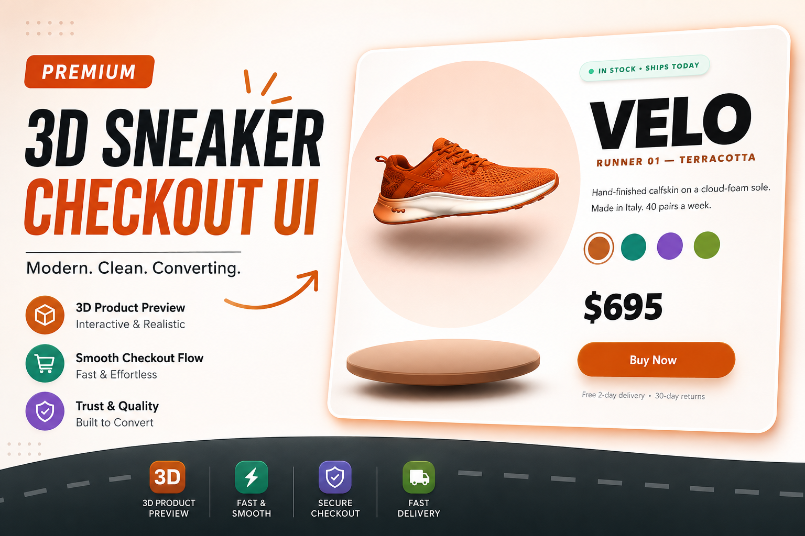
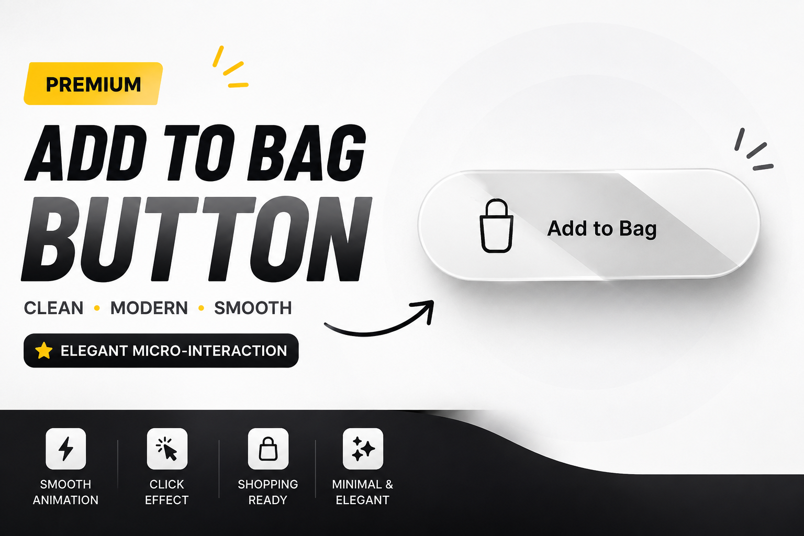
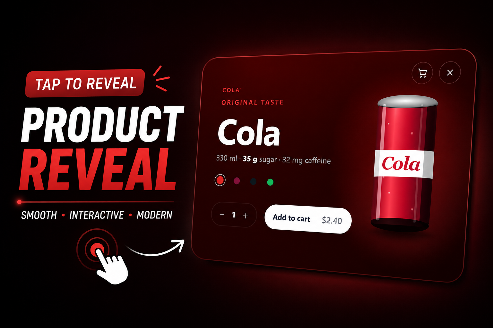
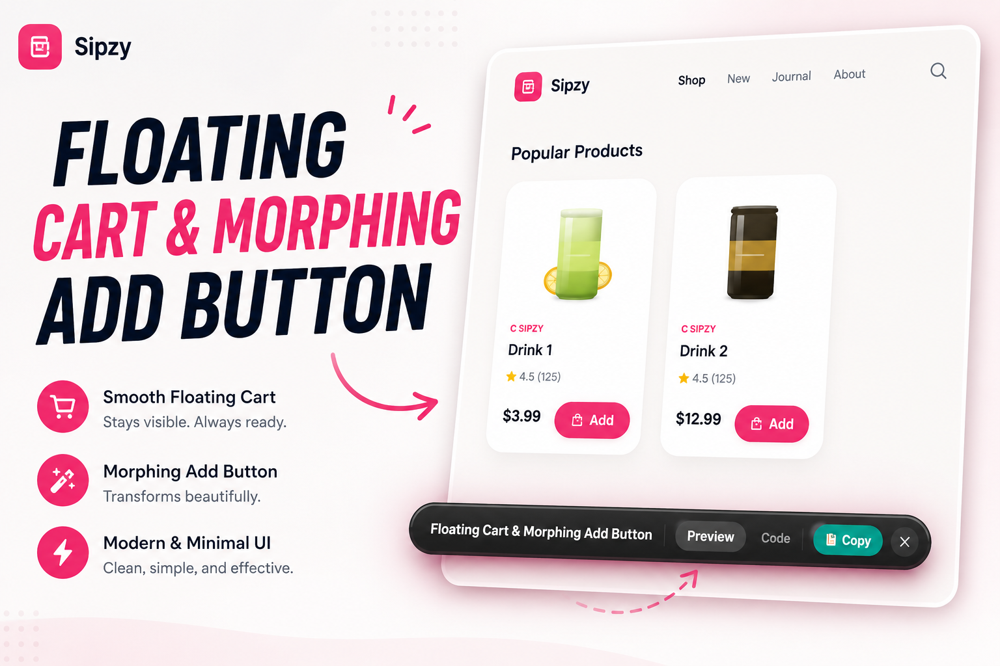
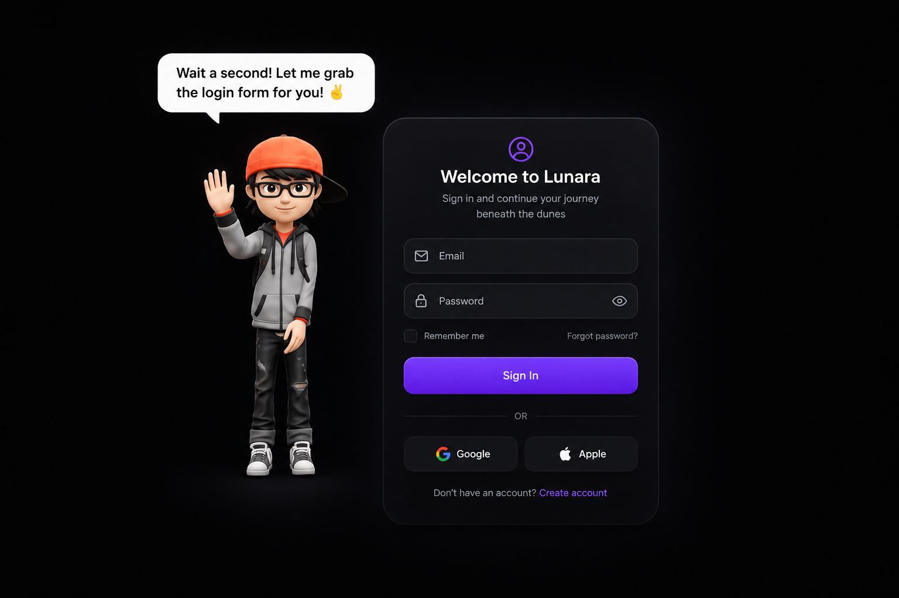
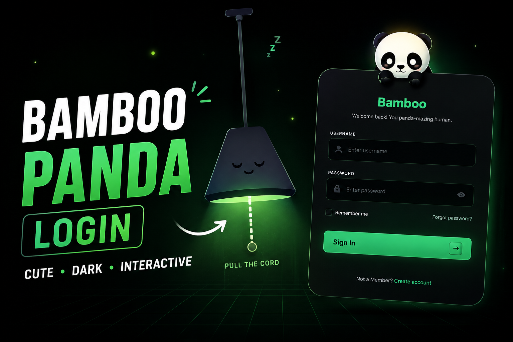
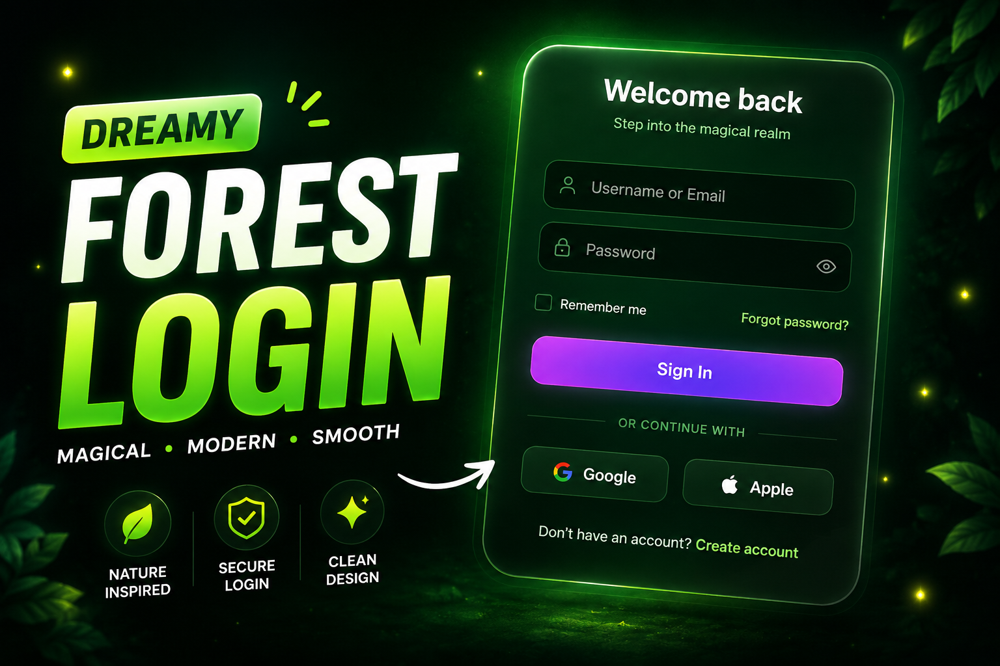
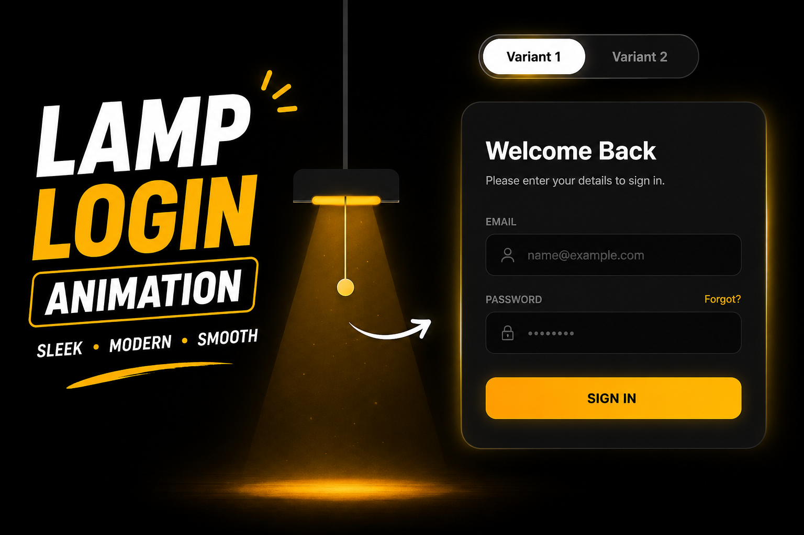
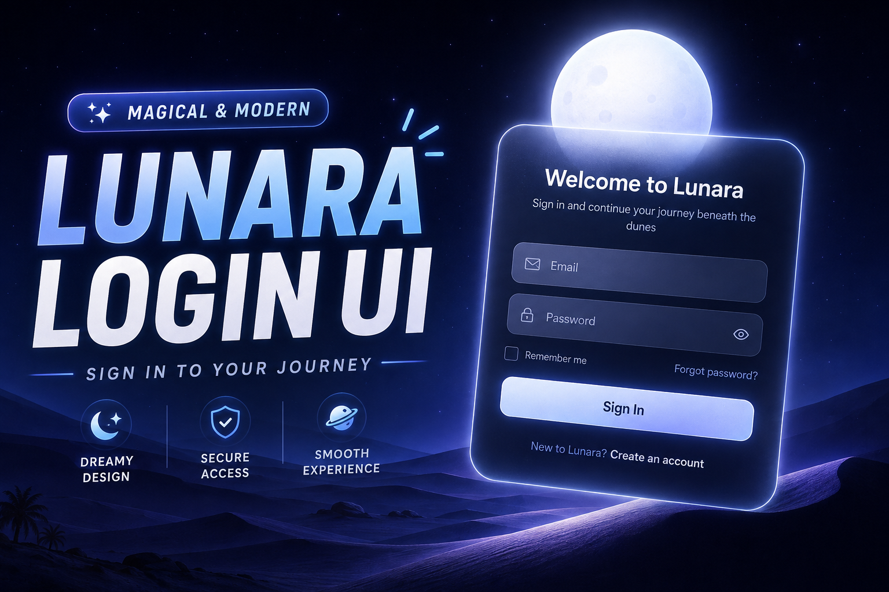
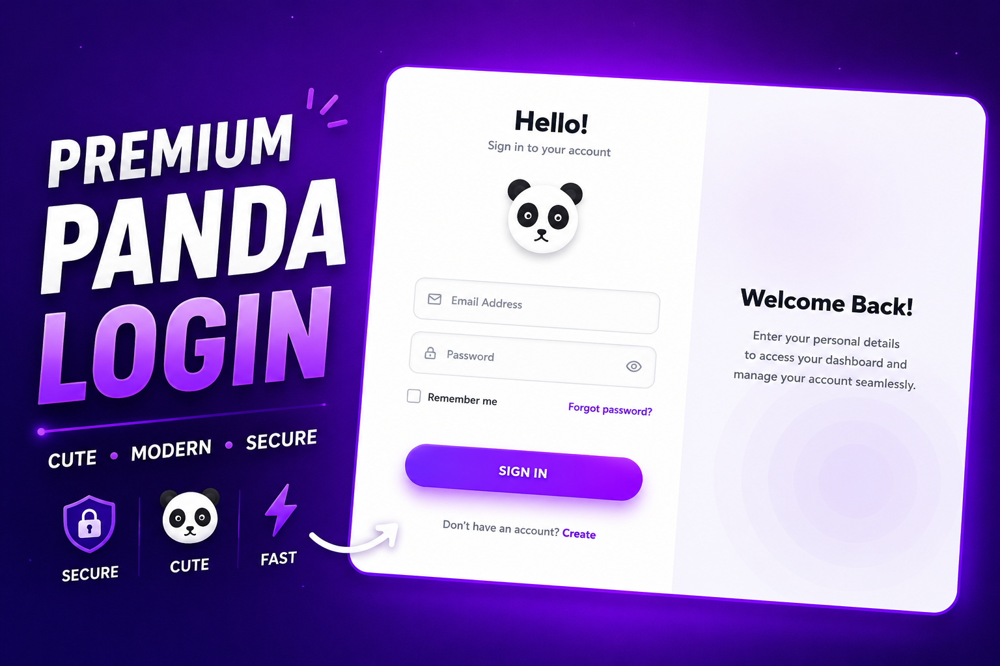

<div align="center">


<a href="https://ui-vault-d0027.vercel.app">
  
</a>

<br/><br/>

<a href="https://ui-vault-d0027.vercel.app">
  
</a>

<br/><br/>

[](https://ui-vault-d0027.vercel.app)


**A free, open-source vault of hand-crafted Tailwind and Framer Motion components. Preview live, hit copy, and ship your next idea faster.**

[🚀 Live Demo](https://ui-vault-d0027.vercel.app) · [🐛 Report Bug](https://github.com/D0027/ui-vault/issues) · [✨ Request Component](https://github.com/D0027/ui-vault/issues)

</div>

---

## 📑 Table of Contents

- [✨ Features](#-features)
- [🎨 Component Gallery](#-component-gallery)
- [🧰 Tech Stack](#-tech-stack)
- [🚀 Getting Started](#-getting-started)
- [📁 Project Structure](#-project-structure)
- [➕ Adding a New Component](#-adding-a-new-component)
- [🌐 Deployment](#-deployment)
- [👨‍💻 Author](#-author)

---

## ✨ Features

<table>
<tr>
<td width="50%">

### 👀 Live Preview
See every component running in real time, with all its animations and interactions.

### 📋 One-Click Copy
Switch to the **JSX Code** tab and copy the full component straight into your project.

### 🔎 Instant Search
Press **Ctrl + K** to search by name or tag from anywhere on the site.

</td>
<td width="50%">

### 🗂️ Category Filters
Browse by category with a sidebar (and quick chips on mobile).

### 🖼️ Full-Screen Preview
Open any component in an immersive modal to test it properly.

### 📱 Fully Responsive
Looks great on desktop, tablet, and mobile, with a glass navbar and smooth scrolling.

</td>
</tr>
</table>

---

## 🎨 Component Gallery

<table>
<tr>
<td align="center" width="33%">
<br/>
<b>👟 Sneaker Checkout 3D</b><br/>
<sub>Box folding, shoe drop, and van delivery</sub>
</td>
<td align="center" width="33%">
<br/>
<b>🛍️ Origami Shopping Bag</b>
</td>
<td align="center" width="33%">
<br/>
<b>🥤 Cola Reveal Card</b>
</td>
</tr>
<tr>
<td align="center">
<br/>
<b>🛒 Floating Cart Interaction</b>
</td>
<td align="center">
<br/>
<b>🧑‍💻 Animated Login Character</b>
</td>
<td align="center">
<br/>
<b>🐼 Bamboo Panda Login</b>
</td>
</tr>
<tr>
<td align="center">
<br/>
<b>🌲 Dreamy Forest Login</b>
</td>
<td align="center">
<br/>
<b>💡 Lamp Login</b>
</td>
<td align="center">
<br/>
<b>🌙 Lunara Sign In</b>
</td>
</tr>
<tr>
<td align="center">
<br/>
<b>💎 Premium Login</b>
</td>
<td align="center">
<br/>
<b>🔐 OTP Verification</b>
</td>
<td align="center">
<br/>
<b>✅ Smooth OTP Verification</b>
</td>
</tr>
</table>

<div align="center">

**[👉 Explore all components live 👈](https://ui-vault-d0027.vercel.app)**

</div>

---

## 🧰 Tech Stack

| Layer | Technology |
|---|---|
| ⚛️ Framework | React (Hooks) |
| ⚡ Build Tool | Vite |
| 🎨 Styling | Tailwind CSS v4 (custom theme tokens) |
| 🎬 Animation | Framer Motion |
| 🔣 Icons | lucide-react |
| 🔤 Fonts | Space Grotesk · Inter · JetBrains Mono |
| ☁️ Hosting | Vercel |

---

## 🚀 Getting Started

```bash
# 1. Clone the repo
git clone https://github.com/D0027/ui-vault.git

# 2. Go into the project
cd ui-vault

# 3. Install dependencies
npm install

# 4. Start the dev server
npm run dev
```

🌍 Open **http://localhost:5173** and you're in.

```bash
# Build for production
npm run build

# Preview the production build
npm run preview
```

---

## 📁 Project Structure

```
ui-vault/
├── public/
│   └── assets/              # Component preview screenshots
├── src/
│   ├── components/          # Site UI: Navbar, Hero, About, Sidebar, Footer...
│   ├── data/
│   │   └── components.jsx   # Registry list (title, category, tags)
│   ├── registry/            # The actual component demos
│   │   ├── SneakerCheckout3D/
│   │   │   ├── index.jsx    # Live component
│   │   │   └── code.js      # Copyable source code
│   │   └── ...
│   ├── App.jsx
│   ├── index.css            # Tailwind theme + custom utilities
│   └── main.jsx
└── index.html
```

---

## ➕ Adding a New Component

1. Create a folder in `src/registry/YourComponent/` with:
   - `index.jsx` — the live component
   - `code.js` — the source code shown in the **JSX Code** tab
2. Add a screenshot to `public/assets/`.
3. Register it in `src/data/components.jsx` with a title, category, and tags.
4. Save, and it shows up on the site with search and filters working automatically ✅

---

## 🌐 Deployment

Deployed on **Vercel**, and every push to `main` redeploys automatically.

```bash
git add .
git commit -m "your message"
git push
```

---

## 🤝 Contributing

Contributions are welcome! Have a cool component idea?

1. 🍴 Fork the repo
2. 🌿 Create a branch: `git checkout -b feature/amazing-component`
3. 💾 Commit: `git commit -m "feat: add amazing component"`
4. 📤 Push: `git push origin feature/amazing-component`
5. 🎉 Open a Pull Request

---

## 👨‍💻 Author

<div align="center">

**Deepak Yadav**

[](https://github.com/D0027)
[](https://linkedin.com/in/deepakyadav027)
[](https://d0027.github.io)

⭐ **If UI Vault helps you, drop a star, it really helps!** ⭐

**Built with React · Tailwind CSS · Framer Motion · Vite**


</div>
